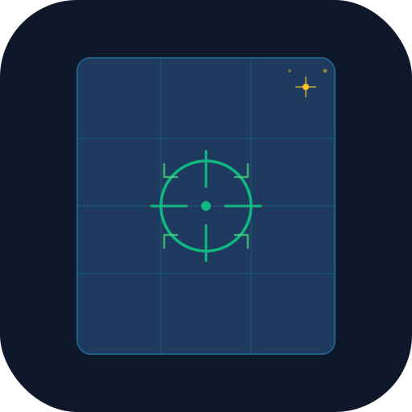

<p align="center">
  
</p>

<h1 align="center">OpenGIS</h1>

<p align="center">
  <strong>Open-source desktop GIS with automatic georeferencing</strong>
</p>

<p align="center">
  <a href="#features">Features</a> •
  <a href="#quick-start">Quick Start</a> •
  <a href="#architecture">Architecture</a> •
  <a href="#local-mode">Local Mode</a> •
  <a href="#roadmap">Roadmap</a> •
  <a href="#contributing">Contributing</a>
</p>

---

## What is OpenGIS?

OpenGIS is a **desktop-first GIS application** that makes georeferencing accessible. Drop in a non-georeferenced image—a scanned map, aerial photo, or historical chart—and OpenGIS will:

1. **Detect** coordinate labels and spatial clues using OCR
2. **Suggest** a coordinate reference system
3. **Compute** a geospatial transform (affine, projective, or polynomial)
4. **Export** a production-ready GeoTIFF, world file, or control point report

No GIS expertise required. Power users get full manual control over every step.

## Features

### 🗺️ Global Data Mode
- Browse and preview georeferenced datasets from tile services
- Built-in basemaps: OpenStreetMap, CARTO (Light/Dark/Voyager), Stadia Stamen
- Sample data: Natural Earth countries, rivers, cities
- Layer panel with opacity, visibility, and reorder controls

### 📐 Local Mode — Automatic Georeferencing
- **Import**: Drag-and-drop images (PNG, JPEG, TIFF, BMP, WebP)
- **Analyze**: OCR-powered detection of coordinate labels, grid references, CRS hints
- **CRS**: Searchable picker with 11+ pre-registered systems, EPSG.io lookup, favorites
- **Align**: Visual overlay preview with opacity slider and control point display
- **Refine**: Full control point editor with undo/redo, transform method selection, per-point residuals
- **Export**: GeoTIFF, world files (PGW/JGW/TFW), CSV control points, JSON audit report

### 🔧 Core Engine
- **Transforms**: Affine (3+ pts), projective (4+ pts), polynomial 2nd-order (6+ pts)
- **Custom linear algebra**: Gaussian elimination with partial pivoting, least-squares solver
- **Confidence scoring**: Automatic quality assessment with warnings
- **Audit trail**: Every computation step logged for reproducibility

### 🖥️ Desktop Application
- Built with Electron for native file access and cross-platform support
- Dark theme with GIS-optimized color palette
- Project save/load with autosave
- Resizable sidebar, minimap toggle, coordinate display

## Quick Start

### Prerequisites
- [Node.js](https://nodejs.org/) 18+ with npm
- Git

### Install & Run

```bash
git clone https://github.com/your-username/opengis.git
cd opengis
npm install
npm run dev           # Web dev server
npm run electron:dev  # Desktop app with Electron
```

### Build

```bash
npm run build          # Production web build
npm run electron:build # Package desktop app
```

### Test

```bash
npm test               # Unit tests (Vitest)
npm run test:e2e       # End-to-end tests (Playwright)
```

## Architecture

```
OpenGIS/
├── electron/              # Electron main + preload
│   ├── main.ts           # Window management, IPC handlers
│   └── preload.ts        # Safe context bridge
├── src/
│   ├── types/            # TypeScript interfaces
│   ├── services/         # Business logic (no React dependency)
│   │   ├── crs/          # CRS management, proj4 integration
│   │   ├── georef/       # Transform engine, clue detectors
│   │   ├── ocr/          # Tesseract.js OCR wrapper
│   │   ├── export/       # GeoTIFF, world file, CSV, JSON export
│   │   ├── image/        # Image import, preprocessing
│   │   ├── catalog/      # Dataset provider registry
│   │   └── project/      # Project CRUD, autosave
│   ├── stores/           # Zustand state management
│   ├── components/       # React components
│   │   ├── layout/       # AppShell, Header, Sidebar
│   │   ├── map/          # OpenLayers MapViewer, LayerPanel
│   │   ├── georef/       # Wizard steps, ControlPointEditor
│   │   └── crs/          # CRS picker
│   ├── screens/          # Page-level route components
│   ├── hooks/            # Custom React hooks
│   └── plugins/          # Plugin SDK
├── assets/
│   ├── icons/            # SVG icon + logo
│   └── sample-data/      # Reference sample datasets
├── tests/                # Vitest + Playwright tests
└── docs/                 # Architecture, Plugin API, Roadmap
```

**Key design decisions:**
- **Services are pure TypeScript** — no React coupling. Testable with plain Vitest.
- **Pluggable detectors** — `ClueDetector` interface allows adding new detection strategies.
- **Transform engine** — custom implementation with no heavy math library dependency.
- **Stores** — Zustand for lightweight, mutable-friendly state with undo/redo support.

See [docs/ARCHITECTURE.md](docs/ARCHITECTURE.md) for deeper details.

## Local Mode

The georeferencing workflow is a 6-step wizard:

| Step | What happens |
|------|-------------|
| **1. Import** | Load an image via drag-and-drop or file picker |
| **2. Analyze** | OCR scans image edges for coordinate labels; clue detectors parse values |
| **3. CRS** | Select source and target coordinate reference systems |
| **4. Align** | Preview overlay with auto-detected control points |
| **5. Refine** | Edit control points, choose transform method, review RMSE |
| **6. Export** | Save as GeoTIFF, world file, or reports |

### Supported Transforms

| Method | Min Points | Use Case |
|--------|-----------|----------|
| Affine | 3 | Maps with uniform scale, rotation, translation |
| Projective | 4 | Photos with perspective distortion |
| Polynomial 2nd | 6 | Scanned maps with non-linear distortion |

### Confidence Scoring

Each solution gets a 0–100% confidence score based on:
- RMSE thresholds (0.5/2.0/5.0 units)
- Number of control points relative to minimum required
- Outlier detection (points with residual > 2× RMSE)

## Tech Stack

| Component | Technology |
|-----------|-----------|
| Desktop shell | Electron 29 |
| Frontend | React 18, TypeScript 5.4 |
| Build | Vite 5.2 |
| Map engine | OpenLayers 9 |
| State | Zustand 4.5 |
| Styling | Tailwind CSS 3.4 |
| CRS | proj4 2.11 |
| OCR | Tesseract.js 5 |
| GeoTIFF | geotiff.js 2.1 |
| Spatial ops | @turf/turf 7 |
| Icons | Lucide React |
| Testing | Vitest, Playwright |

## Roadmap

### Stage 1 — MVP ✅
- [x] Desktop app shell with Electron
- [x] Map viewer with basemaps (OpenLayers)
- [x] Project save/load
- [x] Local image import with drag-and-drop
- [x] CRS selection with EPSG lookup
- [x] OCR coordinate detection
- [x] Manual control point editor with undo/redo
- [x] Affine, projective, polynomial transforms
- [x] Overlay preview with opacity
- [x] GeoTIFF + world file export
- [x] Sample catalog (basemaps, Natural Earth)
- [x] App icon and branding

### Stage 2 — In Progress
- [ ] Visual control point placement (click on image + map)
- [ ] Multi-image batch georeferencing
- [ ] Plugin SDK with hook system
- [ ] GeoJSON/Shapefile layer import
- [ ] Measurement tools (distance, area)

### Stage 3 — Planned
- [ ] WMS/WMTS/WFS data source connections
- [ ] Vector digitizing tools
- [ ] Print layout composer
- [ ] Coordinate grid overlay
- [ ] Thin-plate spline transform

### Stage 4 — Future
- [ ] Cloud tile hosting integration
- [ ] Collaborative editing
- [ ] AI-assisted feature detection
- [ ] 3D terrain visualization
- [ ] Mobile companion app

See [docs/ROADMAP.md](docs/ROADMAP.md) for the full roadmap.

## Contributing

Contributions welcome! Please read [CONTRIBUTING.md](CONTRIBUTING.md) before submitting a PR.

```bash
# Fork and clone
git clone https://github.com/your-username/opengis.git
cd opengis
npm install
npm run dev

# Create a feature branch
git checkout -b feat/my-feature

# Make changes, then test
npm test

# Submit a PR
```

## License

MIT — see [LICENSE](LICENSE) for details.

---

<p align="center">
  Built with ❤️ for the geospatial community
</p>
